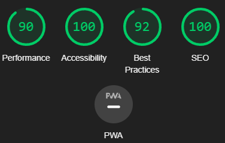

# RPS-7

RPS-7 stands for Rock Paper Scissors 7 ways and has been designed for those that wish to play a more complex version of the traditional rock paper scissors game. This site demostrates how JavaScript can be used to create working games that can be played singl-player. RPS-7 is a website that allows users to play a JavaScript game of RPS-7 against a computer, with the first to 10 points being crowned as the winner.

Live URL: <https://jftjenkins.github.io/rps-7/>

## Features

### Existing Features

- __The RPS-7 Heading__

  - At the top of the page, the title for the page is shown which tells the user the name of the game, and the rules for winning ("First to 10 wins!")

- __The Rules Area__

  - The next section shown is the area that explains the rules of the game. The choices are shown using <b>bold text</b> so that users can easily identify how interactions work. This text was taken directly from [rps-7](https://www.umop.com/rps7.htm)

- __The Results Area__

  - Below the Rules Area, is the Results section, which shows the Player's Choice and the Computer's Choice along with a Results Box below to show who has won each round. When a player clicks an icon from the Player Choice section below this, the icon will show in the Player's Choice box, along with the Computer's Choice, which is randomly selected. From this, the results box will say what the Player chose, and what the Computer chose, and who won or if it was a tie.
  - This allows the user to see what they have chosen, and easily see what the computer has chosen, along with the results.

- __The Player Choice Area__

  - This area is what the user uses to choose what they will play in each round of the game. When a user hovers over one of the icons, the background of it will turn grey and the cursor will become the pointed icon to highlight to users what they are choosing.

- __The Results Area and Reset Button__

  - This section keeps track of the player and computer scores throughout the game. It also features a reset button which, if clicked, resets the game for if user's are unhappy with how the game is going.

- __Game End Modal__

  - Once either the computer of the player reaches 10 points, a Modal will pop up announcing the winner, with a Restart button bellow it that, when clicked, resets the game back to its original state.

### Features Left to Implement

- Other features that could be added at a later point could include being able to choose to play against either another human player, or against a computer
- A difficult setting could be implemented, maybe where easy mode is the tradition Rock Paper Scissors, Normal Mode uses 5 choices, and then Hard Mode is what is presented here.

## Testing

To test the website, I made sure to click all the choices to make sure the images were appearing properly in the choice-box. I also made sure that the correct text was coming up for each interaction and the score counter was increasing correctly when necessary. I also made sure that, if a tie occured, that the score counter would not change. I made sure that the game would end once either the player or the computer reached a score of 10 and that it announced the correct winner. Both the reset and restart button work as intended and there are no broken image files within the website.

I also checked the website using the Lighthouse feature which came back with all aspects above 90

An interesting bug that I came across was that the blinking text cursor appears between the player choice buttons. However, when I tested this on a different laptop, this was not an issue, and it also was not an issue on different browsers (I was using Google Chrome when I discovered this bug).

### Validator Testing

- HTML
  - No errors were returned when passing through the official [W3C HTML validator](https://validator.w3.org/nu/#textarea)
- CSS
  - No errors were found when passing through the official [W3C CSS validator](https://jigsaw.w3.org/css-validator/validator)
- JavaScript
  - No errors were found when passing through the official [Jshint validator](https://jshint.com/)
    - The following metrics were returned: 
    - There are 11 functions in this file.
    - Function with the largest signature take 1 arguments, while the median is 0.
    - Largest function has 15 statements in it, while the median is 4.
    - The most complex function has a cyclomatic complexity value of 3 while the median is 1.

### Unfixed Bugs

As mentioned above, I discovered that on my laptop, whilst running the website on Google Chrome, the blinking text cursor appears when the user clicks between the buttons. However, I was unable to replicate this bug when running the website through different browsers, or on different devices including other computers. I have therefore been unable to locate the source of this bug, and have concluded that it may be something on my laptop.

## Deployment

- The site was deployed to GitHub pages. The steps to deploy are as follows:
  - In the GitHub repository, navigate to the Settings tab
  - From the source section drop-down menu, select the Master Branch
  - Once the master branch has been selected, the page will be automatically refreshed with a detailed ribbon display to indicate the successful deployment.

The live link can be found here - <https://jftjenkins.github.io/rps-7/>

## Credits

### Content

- The text for the rules along with the idea was taken from [RPS-7](https://www.umop.com/rps7.htm)
- The icon for the favicon was taken from [Font Awesome](https://fontawesome.com/)

### Media

- The [Crumpled Paper Ball](https://www.rawpixel.com/image/3953202) was by [rawpixel.com](https://www.rawpixel.com/)
- The Water Drop Image was by <a href="https://www.freepik.com/free-vector/hand-drawn-animation-frames-collection_31828228.htm#&position=0&from_view=collections">Freepik</a>
- The Sponge Image was by <a href="https://www.freepik.com/free-psd/cleaning-elements-illustration_58596991.htm#&position=1&from_view=collections">Freepik</a>
- The Fire Image was by <a href="https://www.freepik.com/free-vector/cartoon-element-animation-frames_13818846.htm#&position=3&from_view=collections">Freepik</a>
- The Air Image was by <a href="https://www.freepik.com/free-vector/hand-drawn-germs-wind-illustration_49159828.htm#&position=4&from_view=collections">Freepik</a>
- The Scissors <a href="https://www.freepik.com/free-vector/scissors-realistic_3056602.htm#&position=5&from_view=collections">Image by katemangostar</a> on Freepik
- The Rock <a href="https://www.freepik.com/free-vector/stones-rocks-cartoon_13050167.htm#&position=6&from_view=collections">Image by macrovector</a> on Freepik
